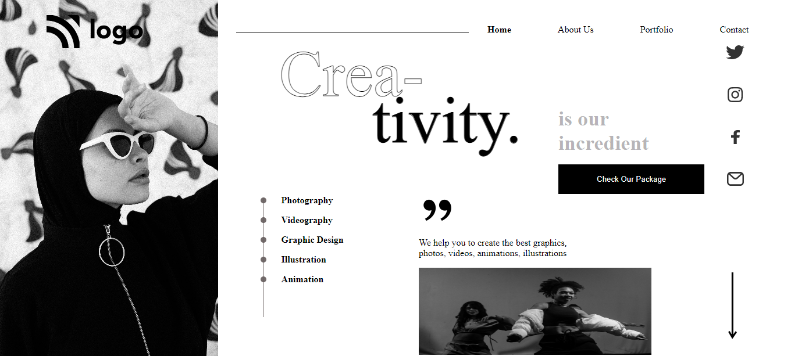

# Project 14 - HTML  and CSS 

> 
>
> By Naga Rajasekhar

You can find the live deployment link of this web page here --> **[Live Deployment Link](https://creativitywebsite.netlify.app/)**
 
 
 
 

 

### Learnings from completing this project

1. Gained knowledge about postions and its properties 
2. Gained knowledge about background and its properties
3. Learnt about image and its properties
4. Gained knowledge about padding, margin, colors, border and their values
